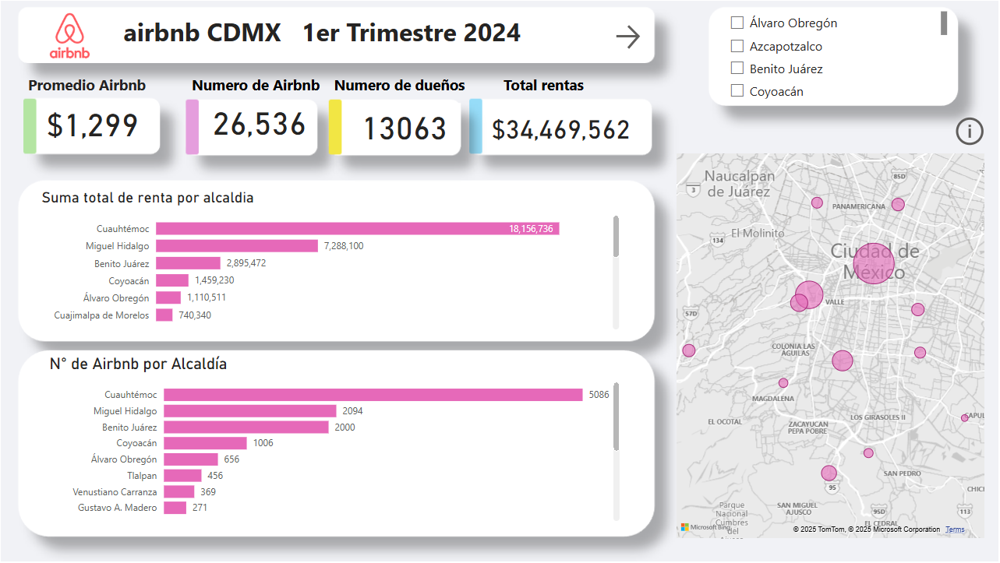
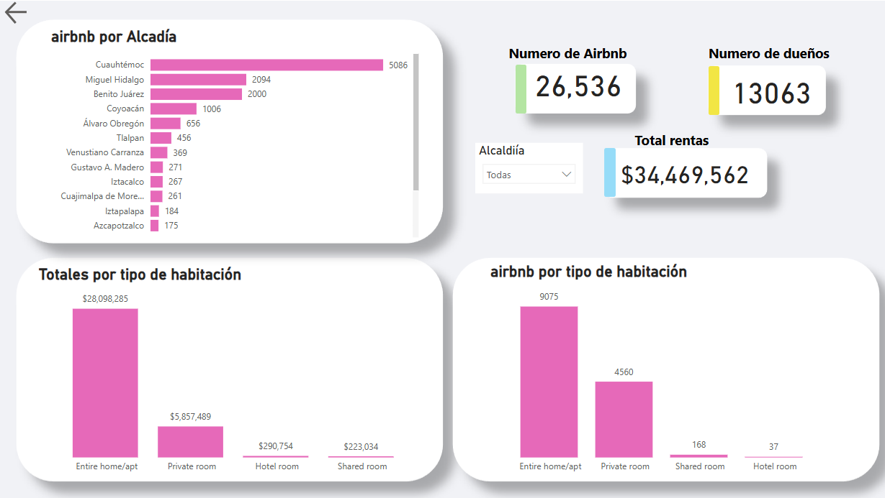
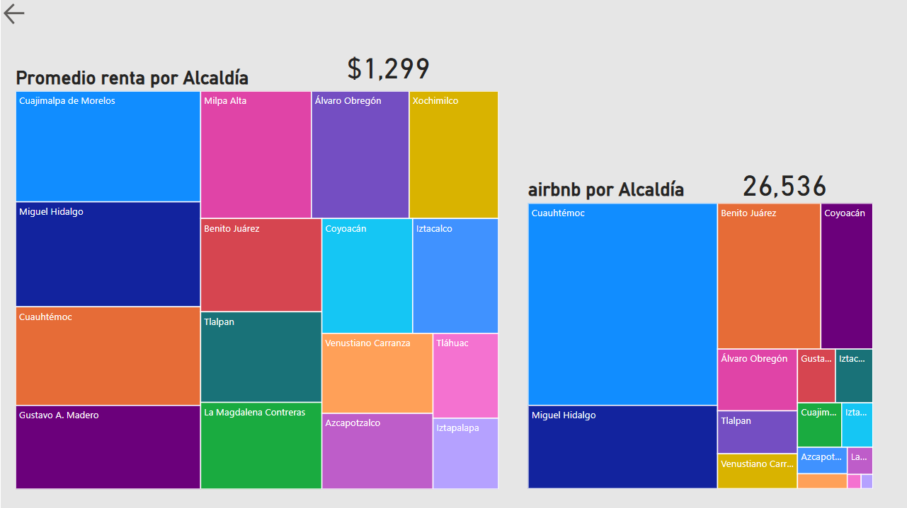

# **Airbnb en Ciudad de México**  

A partir de octubre de 2024, los inmuebles registrados en plataformas digitales de alojamiento, como Airbnb, en la Ciudad de México, solo podrán ser rentados por un máximo de seis meses al año. Esta medida, aprobada por el Congreso de la Ciudad de México, busca mitigar la gentrificación y abordar la "competencia desleal" que estas plataformas representan frente a los hoteles tradicionales enfocados en el turismo, según se detalla en el dictamen legislativo.  

Ante esta nueva regulación, resulta relevante analizar el panorama actual de Airbnb en la Ciudad de México. En este breve análisis se abordan las siguientes preguntas clave:  

- ¿Cuántos inmuebles están registrados en Airbnb dentro de la Ciudad de México?  
- ¿Cuál es la distribución de estos inmuebles por alcaldía?  
- ¿Cuántos propietarios gestionan estas propiedades?  
- ¿Qué ingresos genera este modelo de alojamiento?  
- ¿Cuáles son los costos promedio por noche en estas propiedades?  

### **Fuentes de datos y herramientas utilizadas**  

Los datos para este análisis fueron obtenidos de [Inside Airbnb](https://insideairbnb.com/get-the-data/), una plataforma que proporciona información detallada sobre la oferta en Airbnb a nivel global.  

El tratamiento y análisis de los datos se realizaron principalmente con:  
- **PostgreSQL**, para la gestión y análisis de bases de datos relacionales.  
- **DAX en Power BI**, para el análisis interactivo y la construcción de métricas clave.  

El código utilizado en este proceso está disponible en GitHub:  
[Consulta el repositorio aquí](https://github.com/Floki-Dreamer/Airbnb_M-xico/blob/main/airbnb_cdmx.sql).  

### **Visualización del análisis**  

La visualización de los resultados se realizó con Power BI. Puedes explorar el dashboard interactivo en el siguiente enlace:  
[Ver dashboard en Power BI](https://app.powerbi.com/view?r=eyJrIjoiYzZjYTQ5MTctMjJlZC00NGYyLTk2Y2QtZGUyYzU4NDUyNDVhIiwidCI6IjY2NWYxNmFlLWVmN2ItNDUwNS04NjdkLTgyMzNkYjVhZWVhZiJ9).  

